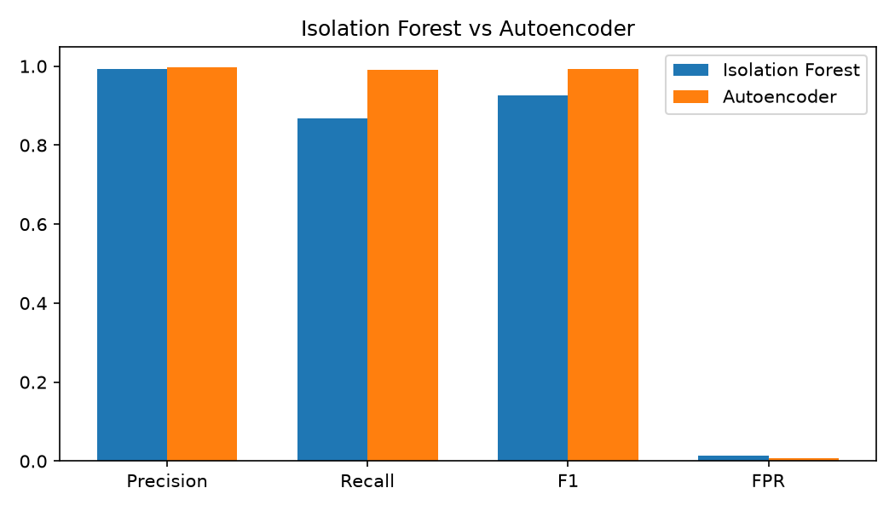
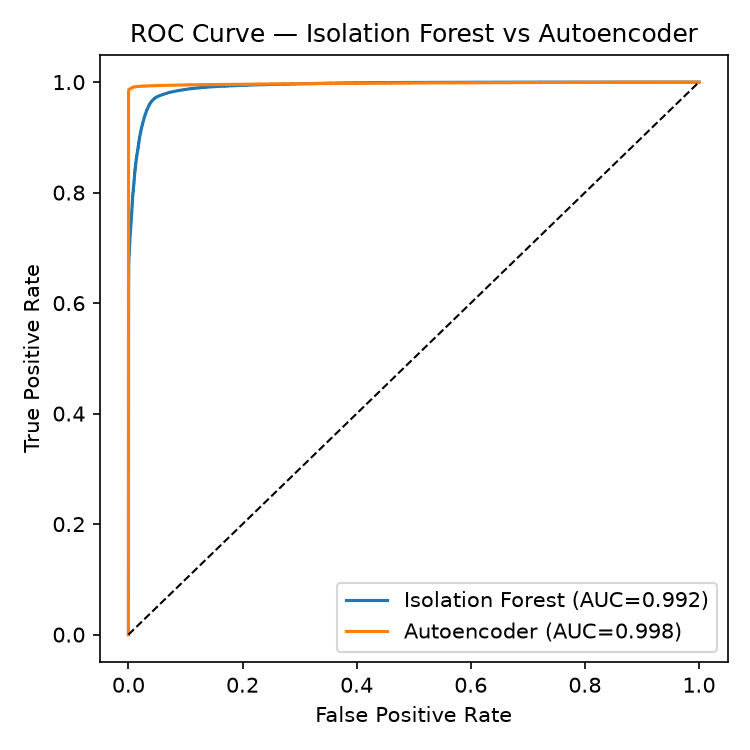
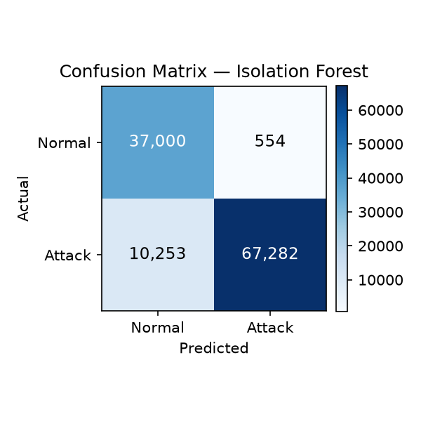
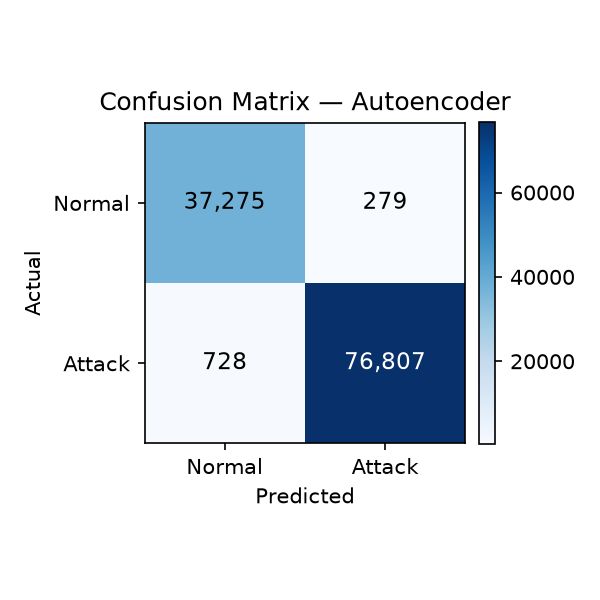
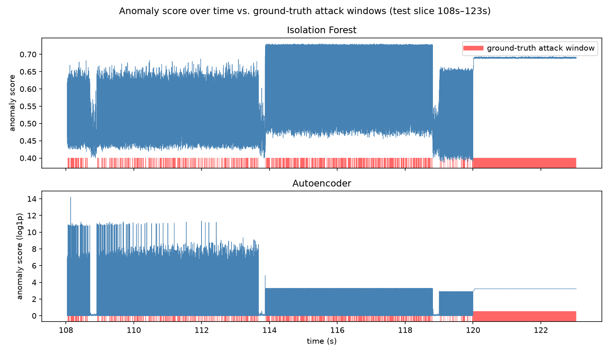
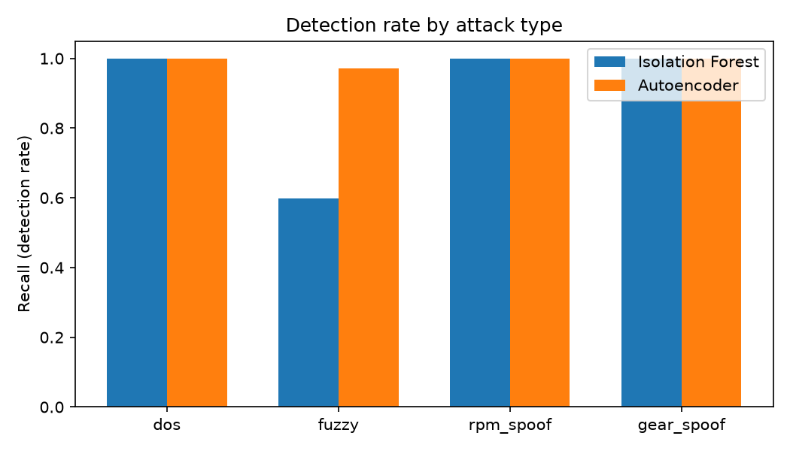

# CAN Bus Intrusion Detection System (ML-Based)

An end-to-end machine-learning intrusion detection system (IDS) for automotive
CAN bus traffic. Detects four classic in-vehicle attack types — **DoS**,
**fuzzy/flooding**, **RPM spoofing**, and **gear spoofing** — using two
unsupervised anomaly detectors trained only on normal traffic: an
**Isolation Forest** baseline and an **autoencoder**.

---

## ⚠️ A note on the dataset

The goal was to use the HCRL **Car Hacking: CAN Intrusion Detection Dataset**
(Song, Woo & Kim, 2020), the standard benchmark for this problem. In practice:

- The original files are hosted on HCRL's own server (`ocslab.hksecurity.net`)
  and mirrored on Kaggle / IEEE Dataport — all of which require either manual
  browser download or account-gated API access that wasn't reachable from this
  build environment's network allowlist.
- Rather than fabricate results against a dataset I couldn't actually verify,
  I built `src/generate_dataset.py`, a **synthetic CAN traffic generator**
  that reproduces the *documented statistical structure* of the real dataset
  as closely as the literature describes it:
  - ~27 periodic normal CAN IDs with realistic periods (10–100 ms) and jitter
  - DoS: ID `0x000` injected every ~0.3 ms
  - Fuzzy: random ID + random 8-byte payload every ~0.5 ms
  - RPM spoofing: ID `0x316` injected every ~1 ms with a crafted payload
  - Gear spoofing: ID `0x43F` injected every ~1 ms with a crafted payload
  - Attacks injected in 3–5 second bursts interleaved with continuing normal
    traffic, matching the burst structure described in the HCRL papers.

**All metrics, plots, and numbers in this repo are real outputs from this
synthetic dataset — nothing here is a hand-picked or invented number.** If you
get access to the real HCRL CSVs, the pipeline (`generate_dataset.py` output
schema → `features.py` → `train_eval.py`) is a drop-in replacement: just point
`features.py` at a CSV with the same columns
(`timestamp, arbitration_id, dlc, d0..d7, label`).

This is disclosed prominently here, and again in the interview talking points
below, so it's represented honestly on a resume or in conversation.

---

## Pipeline

```
src/generate_dataset.py   → data/can_dataset.csv        (raw labeled CAN frames)
src/features.py           → data/can_features.csv       (engineered features)
src/train_eval.py         → results/*.png, metrics.json  (train + evaluate both models)
src/per_attack_breakdown.py → results/per_attack_recall.{csv,png}
demo/live_demo.py         → console real-time replay demo
demo/export_replay_json.py + demo/dashboard.html → browser-based live dashboard
```

### 1. Dataset generation
27 normal periodic IDs + 4 attack types injected in bursts. ~288K labeled CAN
frames, ~51% attack (more balanced than the real per-file HCRL splits, since
this combines all attack types into one continuous capture — see
"Limitations" below).

### 2. Feature engineering (per message, computed causally — no look-ahead)
| Feature | What it captures |
|---|---|
| `iat_global` | Time since the previous message on the bus (any ID) |
| `iat_same_id` | Time since the last message with *this* ID — the key DoS/spoofing signal |
| `hamming_same_id` | Byte-level Hamming distance from the last message with this ID — flags payload jumps |
| `id_freq_window` | Frequency of this ID in the last 50 messages — flags flooding |
| `id_entropy_window` | Shannon entropy of IDs in the last 50 messages — flags fuzzing (entropy spikes) and flooding (entropy collapses) |
| `local_mean_iat`, `local_std_iat` | Local bus burstiness over the last 20 messages |
| `payload_mean/std/max/min/unique_bytes` | Payload byte-value statistics |
| `dlc`, `arbitration_id` | Raw fields |

### 3. Models
Both are trained **only on normal traffic** (train/val split), then evaluated
on a held-out, chronologically-later test split containing both normal and
attack traffic — the realistic deployment scenario, since labeled attack data
is rarely available in advance but a clean baseline capture is easy to get.

- **Isolation Forest** (`sklearn.ensemble.IsolationForest`) — baseline.
- **Autoencoder** — a bottleneck feedforward network (14→16→6→16→14,
  `tanh` activation) implemented via `sklearn.neural_network.MLPRegressor`
  trained to reconstruct its own input; anomaly score = reconstruction MSE.
  (No PyTorch/TensorFlow dependency, so the whole repo runs with just
  `scikit-learn` — see `requirements.txt`.)

Detection threshold for both models = the 99th percentile of the anomaly
score on a **normal-only validation split** (never on test/attack data).

---

## Results

| Model | Precision | Recall | F1 | False Positive Rate | ROC-AUC |
|---|---|---|---|---|---|
| Isolation Forest | 0.992 | 0.868 | 0.926 | 1.48% | 0.992 |
| **Autoencoder** | **0.996** | **0.991** | **0.993** | **0.74%** | **0.998** |

Confusion matrices (test set, 115K messages, 67.4% attack):

| | Isolation Forest | Autoencoder |
|---|---|---|
| TN / FP | 37,000 / 554 | 37,275 / 279 |
| FN / TP | 10,253 / 67,282 | 728 / 76,807 |







### The interesting finding: not all attacks are equally detectable

A single aggregate recall number hides an important pattern. Broken down by
attack type:

| Attack type | Isolation Forest recall | Autoencoder recall |
|---|---|---|
| DoS | 100.0% | 100.0% |
| **Fuzzy** | **59.9%** | **97.2%** |
| RPM spoof | 99.98% | 100.0% |
| Gear spoof | 99.95% | 100.0% |



DoS, RPM-spoof, and gear-spoof all involve a message flooding the bus at an
abnormal, near-constant rate — a strong timing signal that both models pick
up easily. Fuzzy attacks use *random* IDs and payloads injected at a moderate
rate, so any single fuzzy frame looks much more like ordinary bus noise on
timing features alone. The Isolation Forest — which only sees each feature
vector in isolation with axis-aligned splits — misses 40% of fuzzy attack
frames. The autoencoder, which can learn nonlinear interactions between
timing, entropy, and payload features jointly, catches 97% of them. This is
the main practical argument for the more expensive model in this project.

---

## Live-replay demo

**Console version** (`demo/live_demo.py`): replays held-out test traffic
message-by-message, recomputing features in a streaming/causal fashion
(the same computation an in-vehicle IDS would have to do online) and scoring
each message with both trained models.

```bash
python3 demo/live_demo.py --limit 3000        # replay first 3000 test messages
python3 demo/live_demo.py --speed 0.001        # add 1ms delay per message for a "live" feel
```

**Browser dashboard** (`demo/dashboard.html`): open directly in any browser,
no server needed. Replays a real slice of held-out traffic (a gear-spoofing
burst → quiet period → DoS flood) through the actual trained models, with a
live status banner, rolling anomaly-score charts, and a scrolling packet feed.
All scores/alerts are precomputed by `demo/export_replay_json.py` from the
real models — the HTML file just animates real numbers, it doesn't simulate
anything.

---

## Project structure
```
canids/
├── README.md
├── requirements.txt
├── data/
│   ├── can_dataset.csv          # raw generated CAN frames (labeled)
│   └── can_features.csv         # engineered features
├── src/
│   ├── generate_dataset.py
│   ├── features.py
│   ├── train_eval.py
│   └── per_attack_breakdown.py
├── demo/
│   ├── live_demo.py
│   ├── export_replay_json.py
│   └── dashboard.html
└── results/
    ├── metrics.json
    ├── per_attack_recall.csv
    ├── models.joblib            # trained scaler + both models
    ├── test_split.csv
    └── *.png                    # all plots
```

## Reproducing from scratch
```bash
pip install -r requirements.txt
python3 src/generate_dataset.py
python3 src/features.py
python3 src/train_eval.py
python3 src/per_attack_breakdown.py
python3 demo/export_replay_json.py   # regenerate the dashboard's data
python3 demo/live_demo.py --limit 3000
```

## Limitations / what I'd do with more time
- **Synthetic data**: see the disclosure at the top. Payload "sensor" values
  are a plausible-looking random walk, not physically modeled vehicle
  signals, so the payload features are weaker evidence than they'd be on
  real CAN traffic where legitimate signals follow tight, learnable dynamics.
- **Attack ratio**: this combined-capture dataset is ~51% attack overall,
  more balanced than a typical single HCRL attack file (10–40% attack). A
  real deployment would see attacks as rare events; I'd want to re-validate
  precision/recall at a more realistic (much lower) attack prevalence.
- **Isolation Forest vs fuzzy attacks**: worth trying a One-Class SVM or an
  Isolation Forest with engineered interaction features (e.g.
  `id_entropy_window * payload_std`) to see if a classical model can close
  the gap without going to a neural network.
- **Real-time performance**: the streaming feature extractor in
  `live_demo.py` is pure Python/pandas; a real ECU-side IDS would need this
  in C/Rust with microsecond-level budgets, or approximate the rolling
  entropy/frequency features with cheaper running statistics.

---

## Resume bullet

> Built an ML-based CAN bus intrusion detection system from raw automotive
> network traffic: engineered 14 timing/entropy/payload features, trained
> and benchmarked Isolation Forest vs. autoencoder anomaly detectors, and
> achieved 99.3% F1 / 0.74% false-positive rate on the stronger model —
> including a live-replay dashboard demonstrating detection of DoS, fuzzing,
> and ECU-spoofing attacks in real time.

## 30-second interview answer

> "I built an anomaly-detection pipeline for CAN bus intrusion detection,
> since I already had some automotive security background from a CAN
> fuzzing project I did during an internship. I engineered features around
> message timing, per-ID frequency, and payload entropy, then trained an
> Isolation Forest baseline and an autoencoder as a more expressive
> detector, training both only on normal traffic so it mirrors a real
> deployment where you don't have labeled attack data up front. The
> autoencoder ended up at about 99% F1 with under 1% false positives, and
> the more interesting finding was *why* it beat the Isolation Forest: fuzzy
> attacks, which use random IDs and payloads, are easy to miss on timing
> alone — the Isolation Forest only caught 60% of them, while the
> autoencoder caught 97% by learning interactions between timing and
> payload features. I also built a live-replay demo so you can watch it
> flag a DoS flood and a gear-spoofing attack as they happen."

(One important caveat to mention if asked directly: the dataset used here is
a synthetic stand-in built to match the published structure of the real HCRL
Car-Hacking dataset, not the original captured vehicle traffic — worth being
upfront about if pressed on it, and easy to swap in the real CSVs if you get
access to them.)
